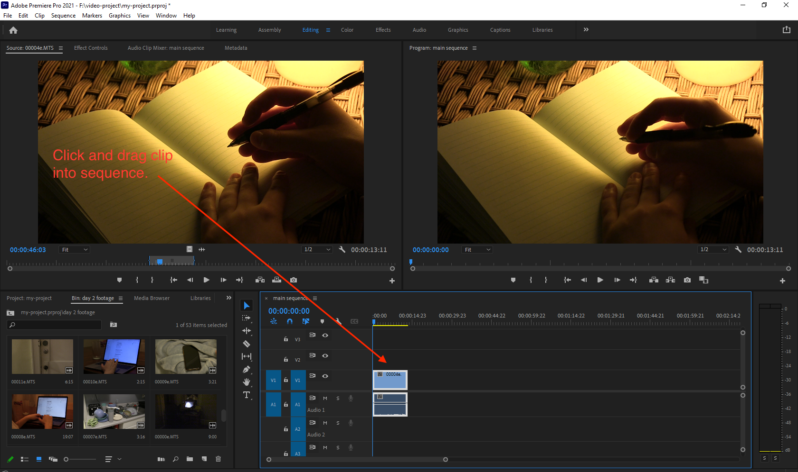

# Adding a clip to your sequence

1. Open a clip in the **Source** monitor and set **In** and **Out** points.
2. Click and drag the clip from the **Source** monitor into your **sequence**.&#x20;
3. Repeat this process for all of the **clips** you would like to add to your **sequence**.

