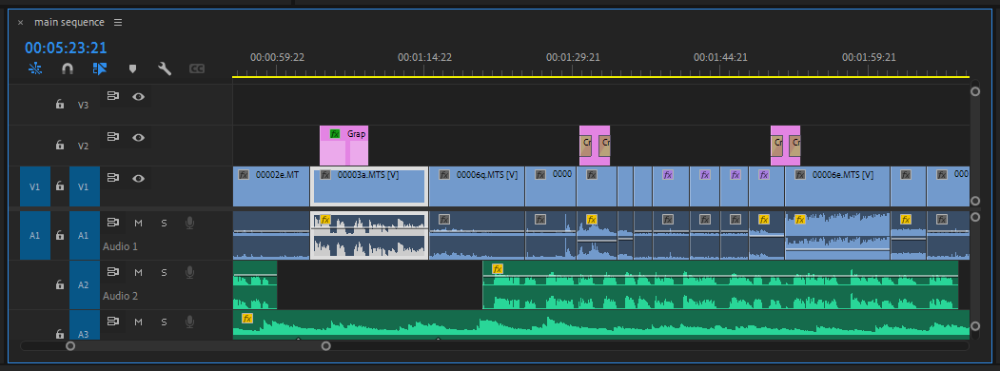

# Arranging items in your sequence

1. Click within the **Timeline** panel to select it.
2. In the **Tool** panel, choose the **Selection** tool (black arrow).
3. Click and drag items in your **sequence** to change the order in which they appear.&#x20;

**Note**: By default, an item will snap to the item closest to it. To turn snapping on or off, click the **Snap** tool or press **S** (on keyboard).

