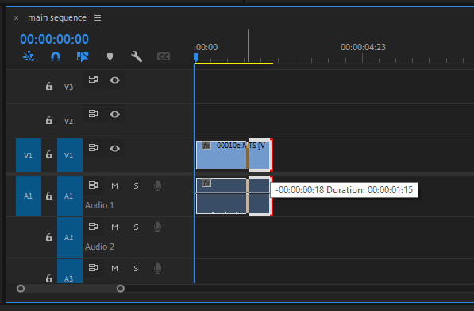

# Trimming or extending an item in your sequence

1. In the **Tools** panel, choose the **Selection** tool (black arrow).
2. Hover your mouse pointer over the left or right edge of an item in your **sequence**. Your mouse pointer will become red **Trim** tool.
3. With **Trim** tool active, click and drag to trim or extend the duration of the item in your **sequence**.

