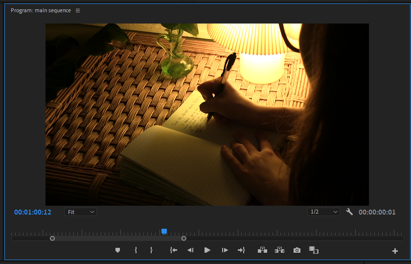

# Viewing your project in the Program monitor

1. Click within the **Timeline** panel to select it.&#x20;
2. In your **sequence**, position the **playhead** over the **clips** you'd like to view.&#x20;
3. Press the **spacebar** on your **keyboard**. Your edited project will play in the **Program** monitor.&#x20;

