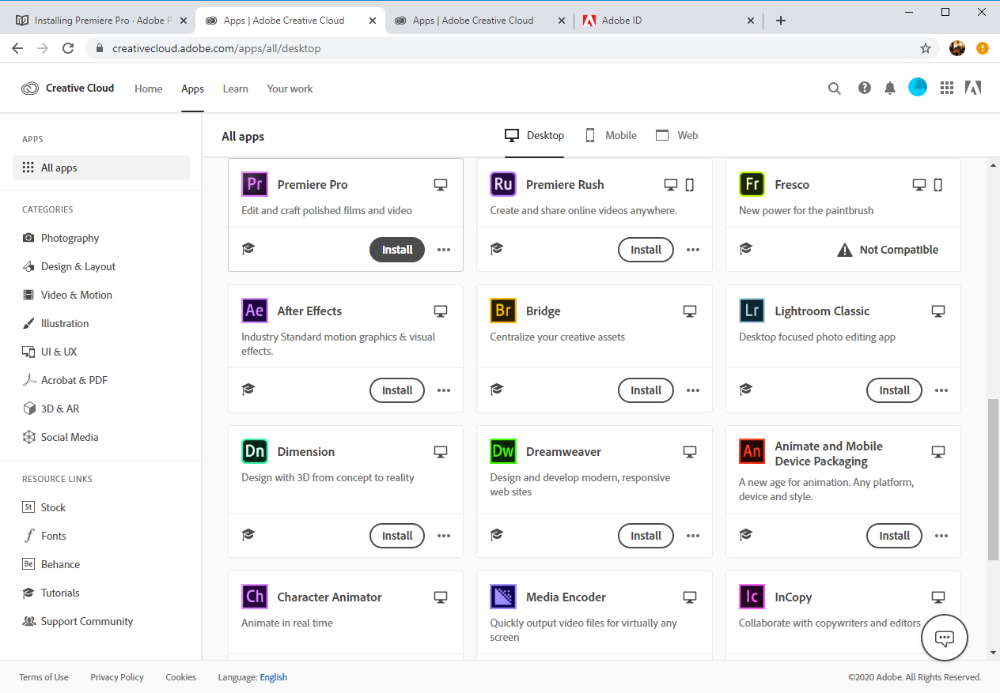

# Installing Premiere Pro

**Important**: When signing up for an Adobe Creative Cloud account, use a non-UWM email address. Your UWM email address will eventually expire, and when this happens, you will no longer be able to do a password reset on your Adobe CC account \(which may make accessing your account impossible.\)

1. Check to make sure your computer meets the [minimum system requirements](checking-if-your-computer-meets-minimum-system-requirements.md).
2. Go to the [Adobe Student Discount page](https://www.adobe.com/creativecloud/buy/students.html) and create an Adobe account using a non-UWM email address. **Note**: Even though you're signing up for a student discount account, you should use a non-UWM email address \(see above.\)
3. Install the Adobe Creative Cloud app on your computer. Use the app to install Adobe CC programs. 

