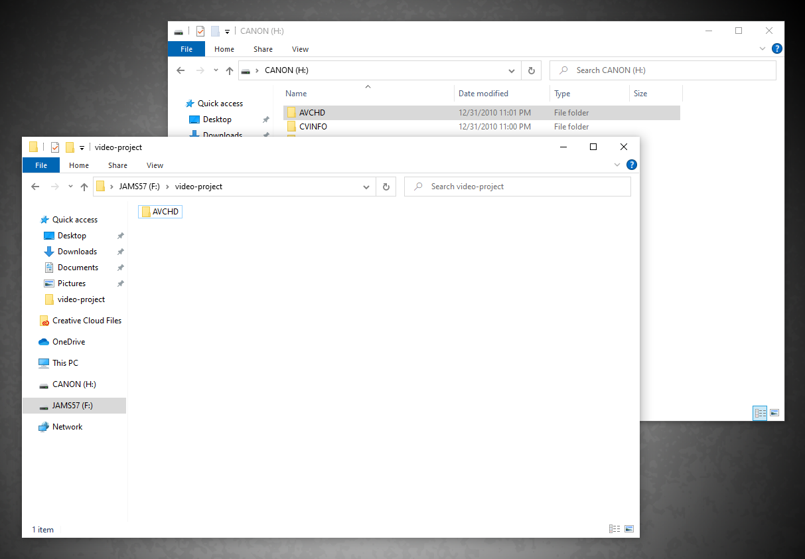

# Copying media files from a Canon video camera into your project folder

Before importing media files into Premiere, you'll need copy these files into your project folder. **Note**: Be sure to follow the instructions for the correct camera (**XA10** or **XA11**.)

### Canon Vixia XA10

1. [Connect your project folder SD card](connecting-your-project-folder-sd-card.md) to the PC.&#x20;
2. Connect the camera to your PC using the USB cable. (The USB miniport on the camera is under the hand flap.)
3. Turn the camera on.
4. On camera, open the side panel.
5. Press **Camera to Play** button.
6. On the camera's touch screen, press **Built-in Mem**. (Do not disconnect or turn off the camera without properly ejecting it from your PC.)
7. On the PC, [Navigate to your project folder](https://techresources.gitbook.io/file-and-folder-management-windows-edition/navigating-folder-tree) in an Explorer window. Then [open a second Explorer window](https://techresources.gitbook.io/file-and-folder-management-windows-edition/opening-multiple-explorer-windows). Select **Canon** in the left pane of the Explorer window.&#x20;
8. Copy the **AVCHD** folder into your project folder.&#x20;
9. After **AVCHD** has copied into your project folder, eject the video camera.&#x20;
10. Disconnect the camera from your PC.
11. In your project folder, rename **AVCHD**. Follow [JAMS file and folder naming conventions](https://techresources.gitbook.io/file-and-folder-management-windows/file-and-folder-naming-conventions).&#x20;
12. [Rename your MTS files](previewing-and-renaming-clips-in-finder.md).

### Canon Vixia XA11, XA15, XA30

1. [Connect your project folder SD card](connecting-your-project-folder-sd-card.md) to the PC.
2. Connect the video camera to your PC using the USB cable. (The USB miniport on the camera is under the front flap.) **Note**: Do not remove the SD card from the camera.
3. On the camera, set the **CAMERA/OFF/MEDIA** switch to **MEDIA**.&#x20;
4. [Navigate to your project folder](https://techresources.gitbook.io/file-and-folder-management-windows-edition/navigating-folder-tree) in an Explorer window. Then [open a second Explorer window](https://techresources.gitbook.io/file-and-folder-management-windows-edition/opening-multiple-explorer-windows). Select **Canon** in the left pane of the Explorer window.&#x20;
5. Copy the **DCIM** folder into your project folder. The **MP4** files you will import into your project file are in the 101\_XXXX subfolder.&#x20;
6. After **DCIM** has copied into your project folder, eject the video camera.&#x20;
7. Disconnect the camera from the PC.

