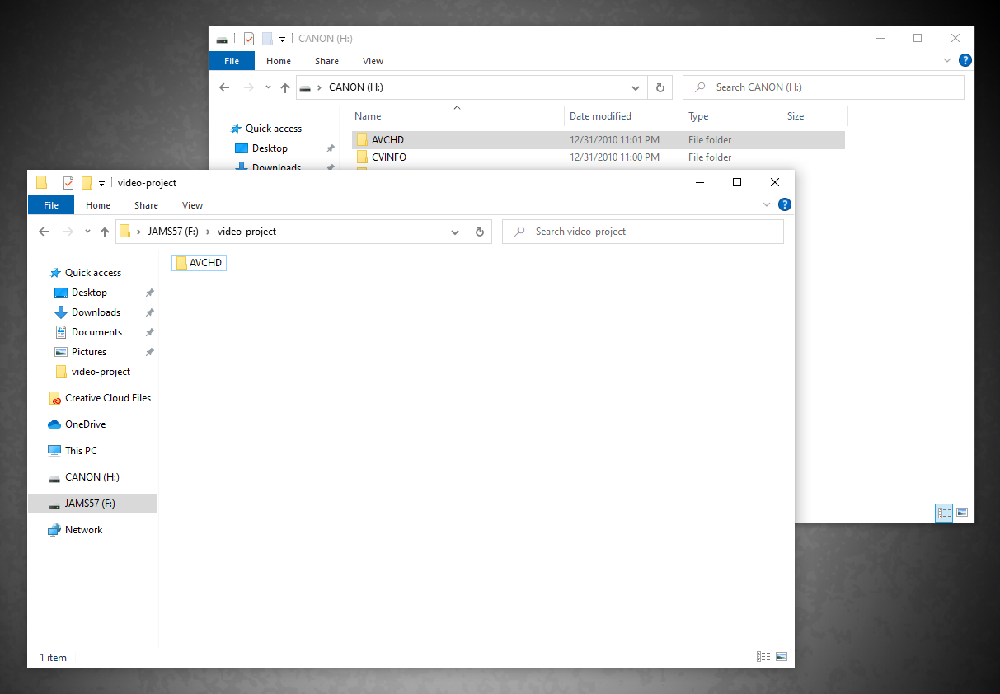

# Copying media files from a Canon video camera into your project folder

Before importing media files into Premiere, you'll need copy these files into your project folder. **Note**: Be sure to follow the instructions for the correct camera (camera model is listed on side of camera).

### Canon Vixia XA11, XA15, XA30

1. [Connect your project folder SD card](connecting-your-project-folder-sd-card.md) (labeled **PROJ**) to a **USB port** on the **PC**.
2. Connect a camera battery to the camera.
3. Connect the video camera to your **PC** using the **USB cable**. (The **USB miniport** on the camera is under the front flap.) **Note**: Do not remove the **SD** **card** from the camera.
4. On the camera, set the **CAMERA/OFF/MEDIA** switch to **MEDIA**.&#x20;
5. [Navigate to your project folder](https://techresources.gitbook.io/file-and-folder-management-windows-edition/navigating-folder-tree) in a **File Explorer** window. Then [open a second Explorer window](https://techresources.gitbook.io/file-and-folder-management-windows-edition/opening-multiple-explorer-windows). Select **Canon** in the left pane of the **File Explorer** window.&#x20;
6. Copy the **DCIM** folder into your project folder. The **MP4** files you will import into your project file are in the **101\_XXXX** subfolder(s).&#x20;
7. After **DCIM** has copied into your project folder, eject the video camera.&#x20;
8. Disconnect the camera from the **PC**.

#### Canon Vixia XA60 

1. [Connect your project folder SD card](https://techresources.gitbook.io/adobe-premiere-basics-windows-edition/setting-up-your-project/connecting-your-project-folder-sd-card) (labeled **PROJ**) to a **USB port** on the **PC**.
2. Remove the **Canon SD card** (labeled **CAM**) from **Canon Vixia XA60 SD card slot**.
3. Insert **Canon SD card** into the **USB-C SD card reader**. **Note:** The **USB-C SD card reader** will be in **Canon Vixia XA60 camera bag**.
4. Connect **USB-C SD card reader** to a **USB-C port** on the **PC**.
5. [Navigate to your project folder](https://techresources.gitbook.io/file-and-folder-management-windows-edition/navigating-folder-tree) in an Explorer window. Then [open a second Explorer window](https://techresources.gitbook.io/file-and-folder-management-windows-edition/opening-multiple-explorer-windows). Select **Canon** in the left pane of the Explorer window.
6. Copy the **DCIM** folder into your project folder. The **MP4** files you will import into your project file are in the **101\_XXXX** subfolder(s).
7. After the **DCIM** folder has copied into your project folder, eject the **Canon** **SD card**.&#x20;
8. Remove the **Canon** **SD card** from the **USB-C SD card reader**. Put the **Canon** **SD card** back in the the **Canon Vixia XA60** camera (**Slot A**). Put the **USB-C SD card reader** back in the camera bag.

