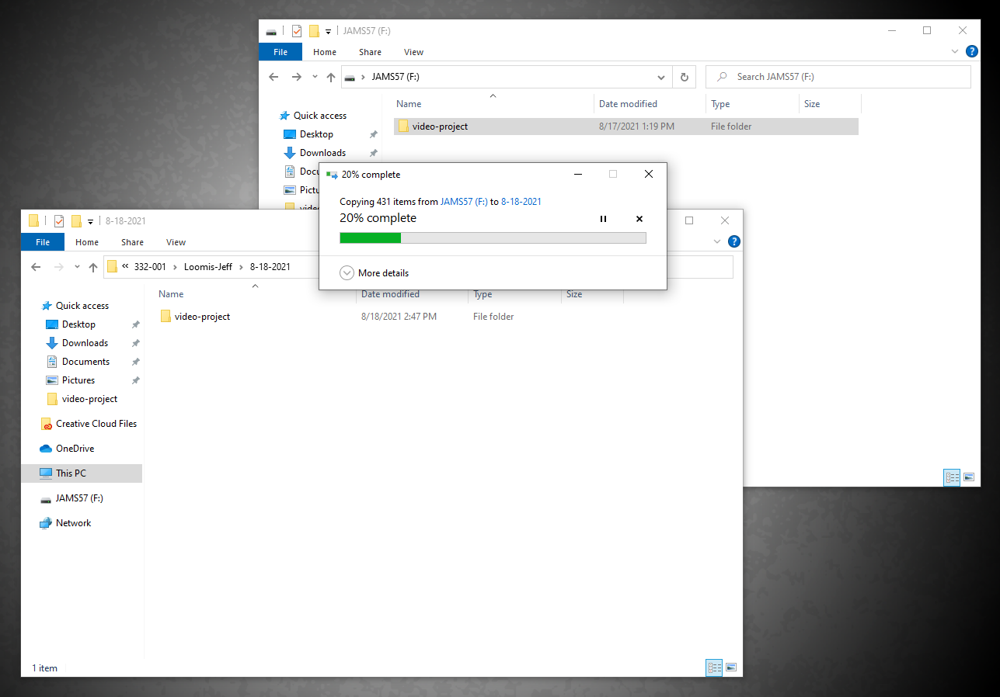

# Backing up your project folder

Be sure to backup your project folder on a regular basis. If anything happens to your project folder SD card, you'll have a backup version in your class folder.&#x20;

<figure><figcaption></figcaption></figure>

### **Connecting to your class folder**

1. **Important**: Do not connect to your class folder until you are done working for the day. Always back up your project folder before leaving the lab.
2. When you are done working for the day, **right-click** the **Start** button (bottom left) and select **File Explorer**.&#x20;
3. In the **File Explorer** window, select **This PC** (on left.)&#x20;
4. Right-click **This PC** (on left.) In the fly-out menu that appears, select **Map network drive.**
5. In the **Map Network Drive** box, leave the default **Drive** letter selected. In the **Folder** field, copy and paste the following string (be sure to copy the full string): \
   \
   `\\ad.uwm.edu\shares\_U_LS\Courses\JAMS`\

6. Click **Finish**. Your class folder will appear in the **This PC** area as a connected drive (probably the **Z** drive.)&#x20;
7. If necessary, [navigate](https://app.gitbook.com/@techresources/s/file-and-folder-management-windows-edition/navigating-folder-tree) to your class folder.

### Backing up your project folder

1. If you haven't done so already, connect to your class folder (see above.)
2. If need be, **right-click** the **Start** button (bottom left) and select **File Explorer** to open a **File Explorer** window.
3. In the **File Explorer** window, select **This PC** (on left.) Double-click the **JAMS drive** (probably the **Z** drive) and [navigate](https://app.gitbook.com/@techresources/s/file-and-folder-management-windows-edition/navigating-folder-tree) into your **class folder**.&#x20;
4. In you **class folder,** create a new folder using today's date as its name using this format: 8-8-2024. **Note**: Do not use slashes in the folder name.
5. To open a second **File Explorer** window, **right-click** the **Start** button (bottom left) and select **File Explorer** (or press **Windows E** on keyboard.)
6. In the second **File Explorer** window, select your **project folder SD card** (on left.) Your **project folder SD card** will be named **SD-CARD-X** (**X** will be a random number.)&#x20;
7. Click and drag your project folder from your **project folder SD** **card** into the folder you created in Step 3. **Important**: Make sure you click and drag the project from your **project folder SD card** into the folder you created in **Step 4** (not the other way around.)

