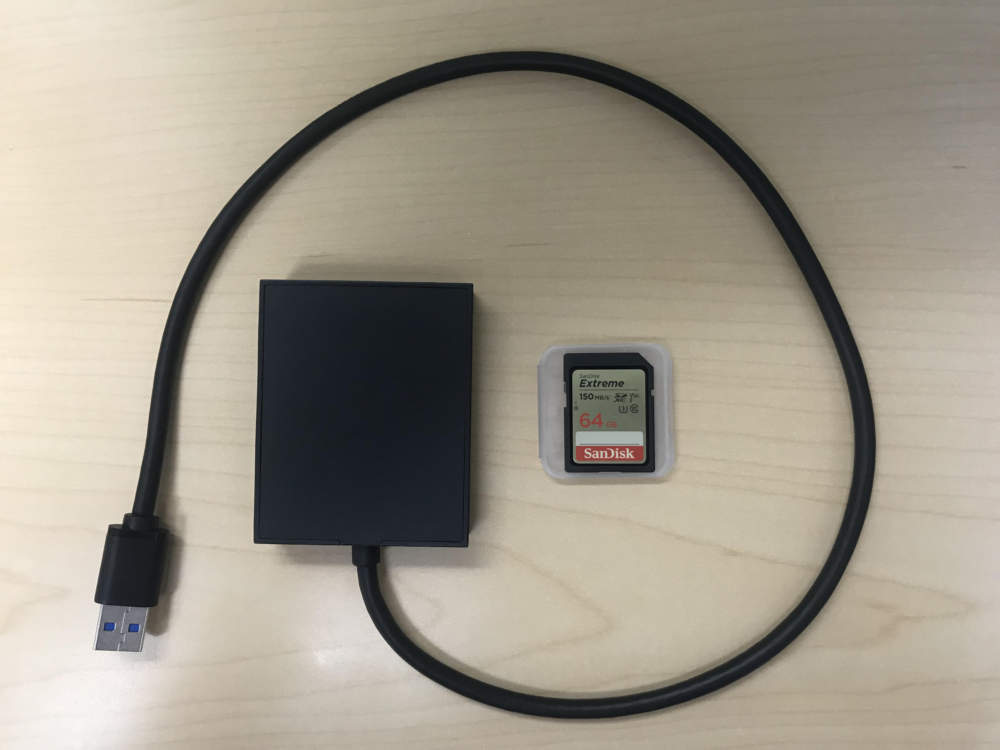

# Connecting your project folder SD card

Your Premiere project and all of the media files associated with it will live in your project folder SD card. Be sure to backup your project folder on a regular basis.

* Using the supplied SD card reader, connect your project folder SD card to USB port on the PC.&#x20;
* When finished, save your project and eject the SD card. Be sure to take the SD card with you when you leave the lab.&#x20;

