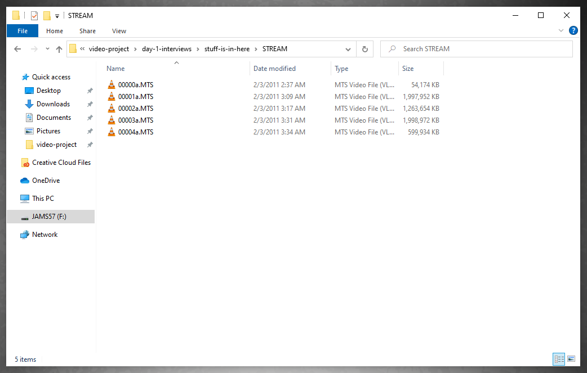

# Previewing and renaming clips

1. If you haven't already done so, copy the media files on your device \(camera, iPhone, Zoom, etc.\) into your project folder. 
2. Disconnect the device and [navigate](https://app.gitbook.com/@techresources/s/file-and-folder-management-windows/navigating-folder-tree) to the media files in your project folder.
   * **Note**: To navigate to media files from a Canon video camera, you'll need to do the following:
     * Go into your renamed AVCHD folder \(see [Copying media files from a Canon video camera](adding-media-from-a-video-camera.md) if you haven't renamed this folder.\)
     * In your renamed AVCHD folder, you'll see two folders \(BDMV and Canon.\) Right-click the BDMV folder. In the fly-out menu, select **Show Package Contents**.
     * In the BDMV folder, you'll see several folders. Double-click **STREAM**. The files \(00000.MTS, etc.\) in this folder are your media files.
3. To preview a media file using VLC, right-click the file and select **Play** in the fly-out menu.
4. After previewing the media file, close VLC. Then rename the media file following [JAMS file and folder naming conventions](https://techresources.gitbook.io/file-and-folder-management-windows/file-and-folder-naming-conventions). Repeat this process as necessary.

