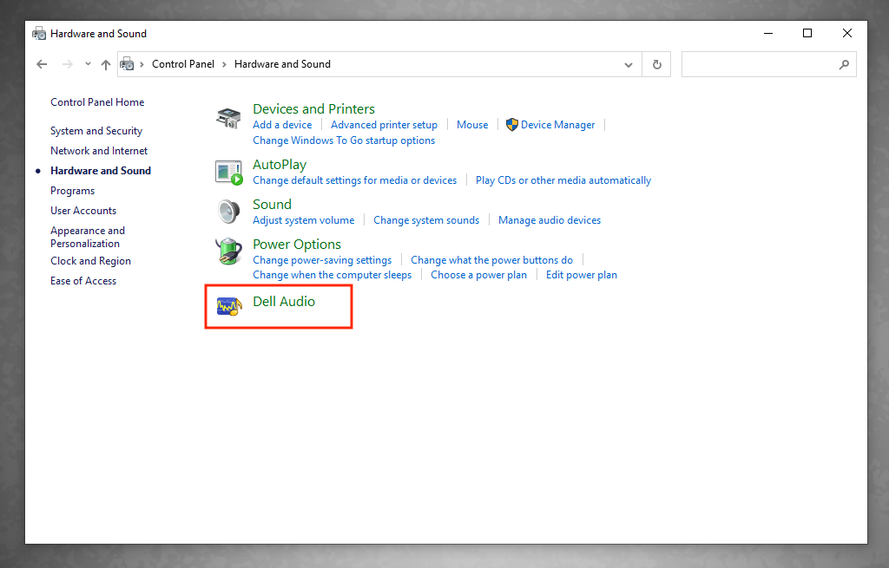

# Audio Sounds Like It's in an Auditorium

### Bolton 510

1. In the **Windows search field** (lower-left corner), search for **Control Panel**.
2. In the **Control Panel** window, click **Hardware and Sound**.
3. In the **Hardware and Sound** window, click **Dell Audio** (see image below).
4. In the **Dell Audio** window, click **Main**.
5. Set the **Speaker Enhancement** toggle button to **Off**.
6. When finished, click the **close** button (upper-right corner) to exit the **Dell Audio** window.&#x20;

<figure><figcaption></figcaption></figure>
