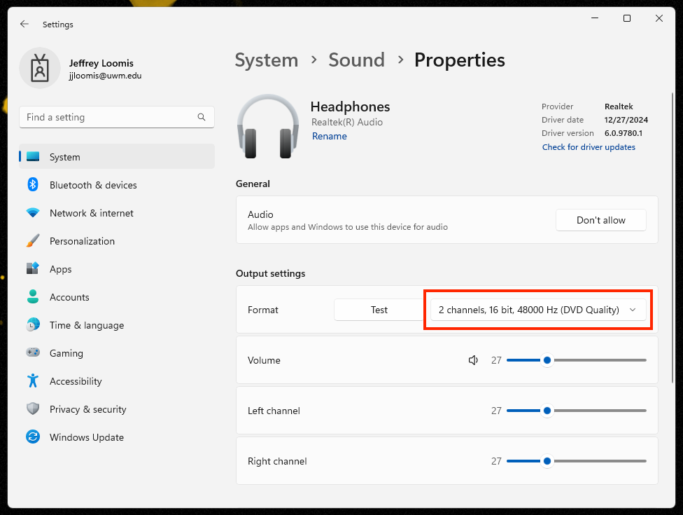

# Project is Taking a Long Time to Load

1. **Save** your project and quit **Premiere**. (You will be re-opening your project, but you need to **Save** it and completely close out of **Premiere** before proceeding with the steps listed below.)
2. If you haven't already done so, connect your **headphones** to the computer.&#x20;
3. In the **Windows search** field (bottom center of screen), search for **Sound Settings**.
4. In the **Sound Settings** window, click **Headphones**.
5. In the **Output settings** area, click the **Format** drop-down list.&#x20;
6. In the **Format** drop-down list, select **2 channels, 16 bit, 48000 Hz (DVD Quality)**.
7. Close the **Sound Settings** window.&#x20;
8. Re-open your **Premiere** project.

<figure><figcaption></figcaption></figure>

