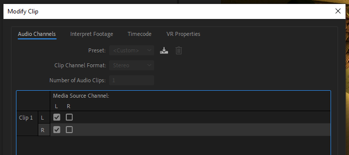
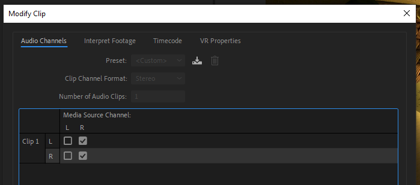

# Centering audio channels

1. In your sequence, right-click a clip.
2. In the fly-out menu, choose **Audio Channels**.
3. In the **Modify Clip** dialog box, select the **Audio Channels** tab.
4. In the **Media Source Channel** panel, select the correct channels to center your audio. See images below for correct settings.

